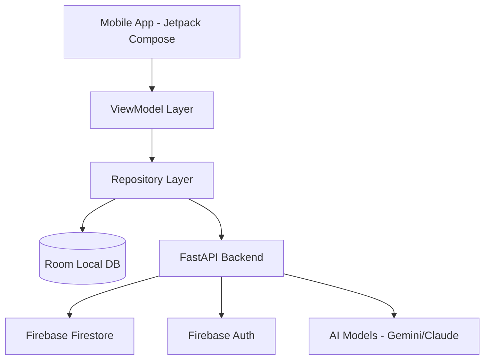

# Akshara Deepa Tutor 🎓
> **Empowering 10th Grade SSLC Students with AI-Driven Personalized Learning**


## 🌟 Overview
**Akshara Deepa Tutor** is a premium, offline-first educational platform designed specifically for 10th-grade SSLC students in rural India. By combining the power of **Jetpack Compose**, **Room Database**, and **Generative AI (Gemini/Claude)**, the app provides a seamless study companion that tracks progress, gamifies learning through quizzes, and offers personalized coaching.

---

## ✨ Key Features

### 📚 Syllabus & Progress Tracking
Stay on top of your studies with a comprehensive tracker covering Science, Math, and Social Studies.
- **45+ Detailed Chapters**: Organized by subject with core concepts.
- **Visual Progress**: Real-time progress bars for each subject.
- **Smart Checkmarks**: Instantly mark concepts as "Learned" or "To-Do".

### 🎯 Intelligent Quiz System
Test your knowledge with timed, subject-specific quizzes.
- **30-Second Sprints**: Quick-fire questions to build exam speed.
- **Instant Feedback**: Learn from your mistakes immediately with detailed explanations.
- **Deterministic Randomization**: Fresh questions every day to keep things interesting.

### 📊 Performance Analytics (Strength Map)
Visualize your academic growth with high-end data visualization.
- **Radar Charts**: See your strengths and weaknesses across subjects at a glance.
- **AI Coach Integration**: Get personalized study tips based on your quiz performance.
- **Leveling System**: Earn badges as you master different topics.


### 🔥 Daily Goals & Streaks
Build a consistent study habit with gamified goal tracking.
- **Custom Goals**: Set how many questions you want to solve daily.
- **Streak Tracking**: Don't break the chain! Visualize your consistency.
- **Topic Recommendations**: The app suggests what to study next based on your weak points.

---

## 🛠️ Technology Stack

| Layer | Technology | Description |
| :--- | :--- | :--- |
| **Frontend** | Kotlin & Jetpack Compose | Modern, declarative UI with premium aesthetics. |
| **Local Database** | Room (SQLite) | Offline-first persistence for all user data. |
| **Cloud Sync** | FastAPI (Python) | High-performance backend bridge for synchronization. |
| **Database (Cloud)** | Firebase Firestore | Real-time data sync across devices. |
| **Authentication** | Firebase Auth | Secure email/password login and signup. |
| **AI Engine** | Gemini / Claude | Personalized study tips and performance coaching. |
| **Architecture** | MVVM + Repository | Scalable, maintainable, and testable codebase. |

---

## 🏗️ System Architecture



---

## 🚀 Getting Started

### Prerequisites
- **Android Studio** (Koala or newer)
- **Python 3.10+**
- **Firebase Account** (for authentication and firestore)

### 1. Backend Setup
1. Navigate to the backend directory:
   ```bash
   cd backend
   ```
2. Create and activate a virtual environment:
   ```bash
   python -m venv .venv
   .\.venv\Scripts\activate
   ```
3. Install dependencies:
   ```bash
   pip install -r requirements.txt
   ```
4. Set up your `.env` file with your **Firebase Service Account Key** and **AI API Keys**.
5. Run the server:
   ```bash
   uvicorn app.main:app --reload --host 0.0.0.0 --port 8000
   ```

### 2. Android App Setup
1. Open the `AksharaDeepaTutor` project in Android Studio.
2. Add your `google-services.json` file to the `app/` directory.
3. Sync Gradle and run the app on an emulator (use `10.0.2.2` to connect to the local backend).

---

## 🛡️ Troubleshooting

### Data Persistence Issues
- **Backend Running?**: Ensure your FastAPI server is active in the background.
- **Firebase Config**: Verify that you have created a **Firestore Database** in the Firebase Console.
- **Local Network**: Ensure `android:usesCleartextTraffic="true"` is enabled in the Manifest for local testing.

---

## 📜 License
Copyright © 2026 Akshara Deepa Tutor. All rights reserved.
Developed for the 10th-grade SSLC educational empowerment initiative.
