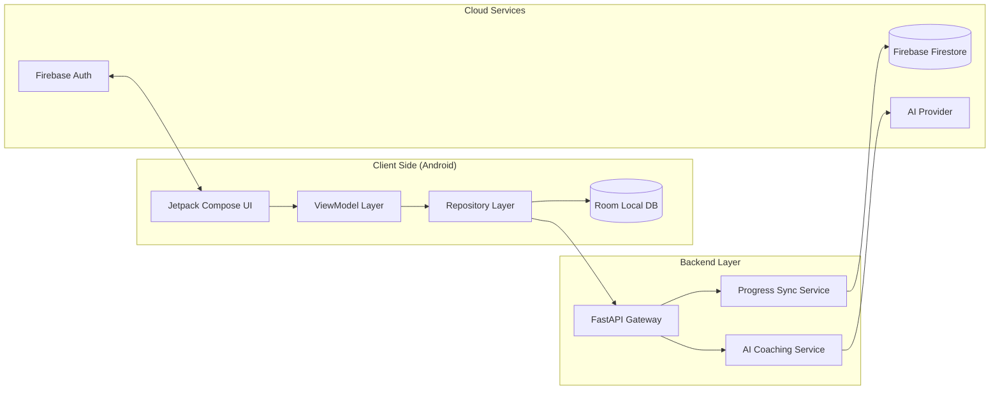

<div align="center">
  
  <h1>Akshara Deepa Tutor</h1>
  <p><strong>AI-augmented self-study app for SSLC (Grade 10) learners in rural India.</strong></p>
  <p>Adaptive practice • Progress analytics • Streaks • Offline-first learning</p>
  <p>
    
    
    
    
    
  </p>

  <p>
    <a href="#features">Features</a> •
    <a href="#tech-stack">Tech Stack</a> •
    <a href="#system-architecture">Architecture</a> •
    <a href="#getting-started">Getting Started</a> •
    <a href="#api-endpoints">API</a>
  </p>
</div>

---

## Problem Statement
Students in rural areas often face limited access to consistent tutoring, exam-focused practice, and timely feedback. Akshara Deepa Tutor delivers a structured SSLC syllabus map, timed practice, and AI-guided tips that work even in low-connectivity settings.

## Solution Highlights
- Syllabus-first learning map for Science, Math, and Social Studies.
- Timed quizzes with explanations and history tracking.
- AI study tips with offline-safe fallback logic.
- Streaks, goals, and progress analytics to keep learners consistent.
- Room-based offline cache with Firestore sync for continuity across devices.

## Features
- Syllabus hub with chapter-wise progress and key concepts.
- 30-second quiz mode for speed building and exam readiness.
- Instant feedback with explanations for every question.
- AI study coach powered by Gemini or Claude (configurable).
- Analytics dashboard with strength mapping and trend history.
- Daily goals, streaks, and topic recommendations.

## Tech Stack

| Layer | Tools |
| --- | --- |
| Mobile | Kotlin, Jetpack Compose, Room, Hilt, Retrofit |
| Backend | FastAPI, Uvicorn, Pydantic, Firebase Admin SDK |
| Cloud | Firebase Auth, Firestore, Firebase Storage |
| AI | Gemini or Claude (configurable) |

## App Branding

<div align="center">
  <table border="0">
    <tr>
      <td align="center">
        
        <br /><b>App Icon</b>
      </td>
      <td align="center">
        
        <br /><b>Round Icon</b>
      </td>
    </tr>
  </table>
</div>

## System Architecture



## Repository Structure

```
.
├─ AksharaDeepaTutor/
│  ├─ app/                        # Android app (Jetpack Compose)
│  ├─ backend/                    # FastAPI backend
│  ├─ gradle/                     # Gradle wrapper
│  ├─ build.gradle.kts
│  └─ settings.gradle.kts
├─ generate_mock_data.py          # Generates Kotlin mock data helper
├─ math_qs.py                     # Math question bank
├─ science_qs.py                  # Science question bank
├─ social_qs.py                   # Social question bank
├─ generate_logo.py               # App icon generator
└─ README.md
```

## Getting Started

### Prerequisites
- Android Studio (JDK 17 configured)
- Python 3.10+
- Firebase project with Auth and Firestore enabled
- Service account JSON for backend admin access

### Backend Setup

```bash
cd AksharaDeepaTutor/backend
python -m venv .venv
```

Windows (PowerShell):
```bash
\.venv\Scripts\activate
```

macOS/Linux:
```bash
source .venv/bin/activate
```

```bash
pip install -r requirements.txt
copy .env.example .env
uvicorn app.main:app --reload --host 0.0.0.0 --port 8000
```

### Android Setup
- Open `AksharaDeepaTutor` in Android Studio.
- Place `google-services.json` inside `AksharaDeepaTutor/app/`.
- Use `AksharaDeepaTutor/app/google-services.example.json` as a template.
- Update `local.properties` with API keys and backend URL (see below).
- Sync Gradle and run on an emulator or device.

## Configuration

### Backend (.env)

| Variable | Description | Example |
| --- | --- | --- |
| `ENVIRONMENT` | Environment name | `dev` |
| `ALLOWED_ORIGINS` | CORS allowed origins | `http://localhost:5173` |
| `FIREBASE_SERVICE_ACCOUNT_JSON` | Full JSON string (preferred) | `{...}` |
| `FIREBASE_CREDENTIALS_PATH` | Path to JSON file | `C:\\keys\\firebase.json` |
| `AI_PROVIDER` | AI engine | `gemini` or `claude` |
| `AI_API_KEY` | API key for AI provider | `your_key` |

If you prefer a file-based credential, use `AksharaDeepaTutor/backend/app/firebase-credentials.example.json` as a starting point.

### Android (local.properties)

| Key | Description | Example |
| --- | --- | --- |
| `BACKEND_BASE_URL` | API base URL | `http://10.0.2.2:8000/` |
| `ANTHROPIC_API_KEY` | Claude key (optional) | `your_key` |

## API Endpoints
- `GET /` health check
- `POST /signup`
- `POST /login`
- `POST /forgot-password`
- `GET /questions?chapter_id=...`
- `POST /submit-quiz`
- `GET /quiz-history?user_id=...`
- `GET /progress?user_id=...&subject=...`
- `POST /update-progress`
- `POST /ai-study-tip`
- `GET /profile?user_id=...`
- `PUT /profile?user_id=...`

## Data and Utilities
- `generate_mock_data.py` builds `MockDataHelper.kt` for local seed data.
- `math_qs.py`, `science_qs.py`, `social_qs.py` contain chapter question banks.
- `generate_logo.py` regenerates launcher icons from a base image.

## Build and Run

From the `AksharaDeepaTutor` folder:
```bash
\.\gradlew assembleDebug
```

## Roadmap
- Add actual UI screenshots and a short demo video.
- Expand AI coaching prompts with difficulty-aware suggestions.
- Add analytics export and teacher dashboard view.

---

<div align="center">
  Built with care for SSLC learners.
</div>
