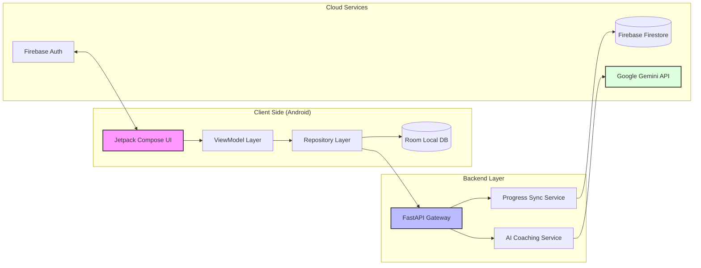

<div align="center">


# 🌟 Akshara Deepa Tutor 🌟
### *Lighting the Path to Academic Excellence for SSLC Students*

[](https://kotlinlang.org/)
[](https://developer.android.com/compose)
[](https://fastapi.tiangolo.com/)
[](https://firebase.google.com/)
[](https://www.sqlite.org/)

---

**Akshara Deepa Tutor** is a state-of-the-art, AI-augmented self-study application designed for 10th-grade students in rural India. It bridges the gap between traditional learning and modern technology with a premium, glassmorphism UI and personalized AI coaching.

[Explore Features](#-key-features) • [View Architecture](#-system-architecture) • [Setup Guide](#-installation)

</div>

---

## 📸 App Showcase

<div align="center">
  <table border="0">
    <tr>
      <td width="50%"></td>
      <td width="50%"></td>
    </tr>
    <tr>
      <td align="center"><b>📚 Smart Syllabus Tracker</b></td>
      <td align="center"><b>📊 Intelligent Strength Map</b></td>
    </tr>
  </table>
</div>

---

## 🚀 Key Features

### 📖 **Comprehensive Syllabus Hub**
*   **Subject Mastery**: Full coverage of Science, Math, and Social Studies.
*   **Progress Visualization**: Dynamic progress rings and bars that update as you learn.
*   **Concept Management**: Break down chapters into manageable concepts.

### ⚡ **Timed Power Quizzes**
*   **30s Timer**: Build speed and confidence for final exams.
*   **Instant Logic**: Immediate feedback with high-quality explanations for every question.
*   **History Tracking**: Review your past attempts and see your growth over time.

### 🤖 **AI Study Coach**
*   **Personalized Tips**: AI analyzes your performance to give you "Next Step" advice.
*   **Performance Analysis**: Ask the AI Coach about your specific strengths and weaknesses.
*   **Offline Fallback**: Intelligent logic ensures study tips are available even without internet.

### 🔥 **Gamified Consistency**
*   **Study Streaks**: Keep your daily learning chain alive with visual streak counters.
*   **Daily Goals**: Set your own target and hit it every day to unlock badges.
*   **Topic Suggestions**: Smart algorithm recommends topics you need to practice most.

---

## 🛠️ Modern Tech Stack

<div align="center">

| 📱 Mobile Frontend | ⚙️ Backend & API | ☁️ Cloud & AI |
| :--- | :--- | :--- |
| **Kotlin** (Modern Android) | **FastAPI** (Python 3) | **Firebase Auth** (Security) |
| **Jetpack Compose** (UI) | **Uvicorn** (ASGI Server) | **Firestore** (Real-time DB) |
| **Room DB** (Local Cache) | **Pydantic** (Validation) | **Gemini / Claude** (Gen AI) |
| **Hilt** (Dependency Injection) | **Firebase Admin SDK** | **Retrofit** (Networking) |

</div>

---

## 🏗️ System Architecture



---

## 📥 Installation

### 1️⃣ **Clone & Prep**
```bash
git clone https://github.com/THARUN-GOWDA-K/AksharaDeepa-Tutor-App.git
```

### 2️⃣ **Backend Startup**
```bash
cd backend
python -m venv .venv
.\.venv\Scripts\activate
pip install -r requirements.txt
uvicorn app.main:app --reload --host 0.0.0.0 --port 8000
```

### 3️⃣ **Android Launch**
*   Open `AksharaDeepaTutor` in Android Studio.
*   Add `google-services.json` to the `app/` folder.
*   Sync Gradle & Run on Emulator! 🚀

---

<div align="center">

**Built with ❤️ for the future of education in India.**  
© 2026 Akshara Deepa Tutor Platform

</div>
